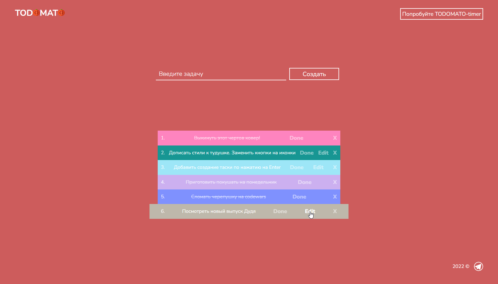

# ToDomato List

Проект представляет собой классический ToDo лист, с функциональной возможностью использовать pomodoro-timer (в разработке).

Используются следующие технологии и паттерны:
1) React (hooks)
2) React Router
3) CSS HTML
4) Адаптивная и отзывчивая верстка
5) БЭМ

### Главная страница проекта

Представляет собой минималистичный дизайн, в основе которого лежит крутой цвет indian-red (по ХЕКсу: #cd5c5c). Слева сверху лого, справа ссылка на еще разрабатываемый pomodoro timer. В центре страницы находится форма в которую необходимо писать свои ToDo. Есть функции редактирования, удаления и пометки выполненным. 

### Установка и запуск проекта
1) Копируем ссылку на проект
2) Открываем терминал в IDE в желаемой папке
3) Пишем команду git clone "ссылка на проект"
4) После клонирования проекта переходим в папку с проектом
5) Далее прописываем в терминале `npm i` 
6) `npm start`
